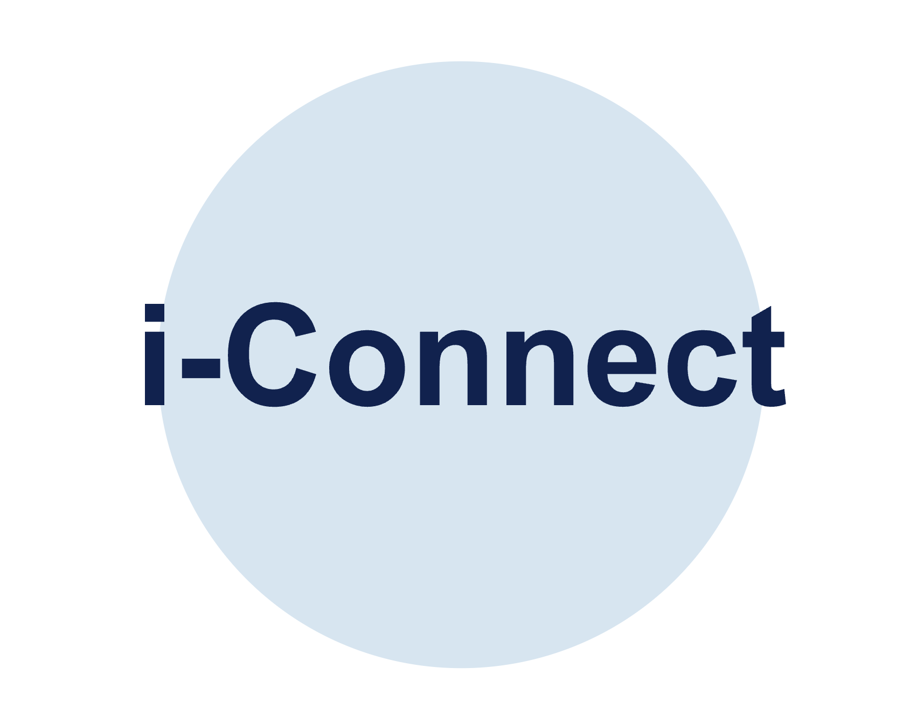

# I-Connect

I-Connect is an innovative communication solution developed to strengthen **Social Defence** in Singapore by overcoming communication barriers faced by the elderly and hearing-impaired communities. Originally developed for YouthxHack, this project has been enhanced with an improved Streamlit UI (replacing the original Django implementation) and optimized for edge computing deployments on Raspberry Pi.

 <!-- Replace with your logo when available -->

## Table of Contents
1. [Introduction](#introduction)
2. [Features](#features)
3. [Project Evolution](#project-evolution)
4. [Technical Architecture](#technical-architecture)
5. [Project Structure](#project-structure)
6. [Installation](#installation)
7. [Usage](#usage)
8. [Edge Computing Version](#edge-computing-version)
9. [Demo Materials](#demo-materials)
10. [Acknowledgements](#acknowledgements)
11. [Citations](#citations)

## Introduction

In Singapore's multi-cultural society, **Social Defence** involves building trust, understanding, and harmony among people of different races, languages, and backgrounds. However, vulnerable groups, such as the elderly who only speak dialects like Hokkien, Cantonese, or Hakka, often face language barriers that limit their participation in community networks and access to essential services. Similarly, hearing-impaired individuals encounter challenges in daily communication, leading to social isolation.

**I-Connect** aims to address these challenges by providing a seamless communication tool that empowers volunteers, caregivers, and community members to interact more effectively with these groups. By breaking down language barriers and enabling smoother communication, I-Connect contributes to the larger goal of Social Defence—ensuring that all Singaporeans, regardless of language or physical ability, are included, understood, and supported, especially during times of crisis.

## Features

- **Speech-to-Speech Translation**: Converts spoken dialect (Cantonese) to English speech and vice versa
- **International Translation Support**: Supports translation between 30+ languages
- **Hand Gesture Recognition**: Recognizes hand gestures and translates them to text
- **Translation History**: Keeps track of previous translations for reference
- **Streamlined UI**: User-friendly interface built with Streamlit for improved accessibility
- **Edge Computing Compatibility**: Optimized version for Raspberry Pi deployments

## Project Evolution

### YouthxHack Original
The project was initially developed for YouthxHack 2024, using Django for the web interface and focused on addressing communication barriers in Singapore's diverse society.

### Current Version
- **UI Migration**: Transitioned from Django to Streamlit for a more interactive and easier-to-deploy interface
- **Enhanced Language Support**: Added support for multiple international languages beyond the initial Cantonese-English focus
- **Improved Hand Gesture Recognition**: Enhanced accuracy and usability of the gesture recognition system
- **Translation History**: Added functionality to track and revisit past translations

### Edge Computing Version
A specialized version of this project was forked from [Black-Seal/edgecomputing](https://github.com/Black-Seal/edgecomputing) and optimized to run on Raspberry Pi, featuring model quantization and optimized performance for resource-constrained devices.

## Technical Architecture

I-Connect combines several advanced technologies to deliver its functionality:

- **Speech Recognition**: Using Google's Speech Recognition API and Wav2Vec2 models
- **Machine Translation**: Leveraging transformer-based models including M2M100 and MarianMT
- **Hand Gesture Recognition**: Implementing MediaPipe and TensorFlow Lite for real-time hand tracking
- **User Interface**: Built with Streamlit for responsive, easy-to-use interaction

## Project Structure

```
I-CONNECT/
│
├── app.py                      # Main Streamlit application entry point
│
├── speechtospeech/             # Speech translation module
│   ├── __init__.py
│   ├── can_to_eng.py           # Cantonese to English translation
│   ├── eng_to_can.py           # English to Cantonese translation
│   └── multilingual_translator.py  # Support for multiple languages
│
├── cv/                         # Computer Vision module for gesture recognition
│   ├── model/                  # ML models for hand gesture recognition
│   │   ├── keypoint_classifier/
│   │   └── point_history_classifier/
│   │
│   ├── utils/                  # Utilities for CV processing
│   │
│   ├── hand_recog.py           # Hand recognition implementation
│   ├── keypoint_classification.ipynb
│   ├── keypoint_classification_EN.ipynb
│   └── point_history_classification.ipynb
│
├── venv/                       # Virtual environment (not tracked in git)
│
├── .gitignore                  # Git ignore file
├── README.md                   # Project documentation
└── requirements.txt            # Project dependencies
```

## Installation

1. Clone the repository
```bash
git clone https://github.com/your-username/I-Connect.git
cd I-Connect
```

2. Create and activate a virtual environment

**macOS/Linux**
```bash
python3 -m venv venv
source venv/bin/activate
```

**Windows**
```bash
python -m venv venv
venv\Scripts\activate
```

3. Install the required dependencies
```bash
pip install -r requirements.txt
```

## Usage

Run the Streamlit app:
```bash
streamlit run app.py
```

Navigate to the provided URL (typically http://localhost:8501) in your web browser.

## Edge Computing Version

A Raspberry Pi optimized version of I-Connect is available in a separate repository forked from [Black-Seal/edgecomputing](https://github.com/Black-Seal/edgecomputing). This version uses quantized models to run efficiently on resource-constrained devices, making it suitable for deployment in community centers, elder care facilities, and other locations where dedicated translation devices are beneficial without requiring constant internet connectivity.

## Demo Materials

Link to Project Poster and Video Demonstration: 
(https://drive.google.com/drive/folders/19sNZMycDbqMWaRQU_knIvtmr5d04HmWu?usp=share_link)

## Acknowledgements

- The Lions Befrienders Service Association for their support and inspiration
- Volunteers and community groups dedicated to bridging communication gaps in Singapore
- YouthxHack 2024 and Dell for providing the platform and motivation to create solutions for social good
- [Black-Seal/edgecomputing](https://github.com/Black-Seal/edgecomputing) for the edge computing implementation foundation
- [kinivi/hand-gesture-recognition-mediapipe](https://github.com/kinivi/hand-gesture-recognition-mediapipe) for the hand gesture recognition models and implementation

## Citations

1. **ASCEND: A Spontaneous Chinese-English Dataset for Code-switching in Multi-turn Conversation**  
*Holy Lovenia, Samuel Cahyawijaya, Genta Indra Winata, Peng Xu, Xu Yan, Zihan Liu, Rita Frieske, Tiezheng Yu, Wenliang Dai, Elham J. Barezi, and others*  
Proceedings of the 13th Language Resources and Evaluation Conference (LREC), 2022.

2. **Beyond English-Centric Multilingual Machine Translation**  
*Angela Fan, Shruti Bhosale, Holger Schwenk, Zhiyi Ma, Ahmed El-Kishky, Siddharth Goyal, Mandeep Baines, Onur Celebi, Guillaume Wenzek, Vishrav Chaudhary, Naman Goyal, Tom Birch, Vitaliy Liptchinsky, Sergey Edunov, Edouard Grave, Michael Auli, Armand Joulin*  
*arXiv preprint* arXiv:2010.11125, 2020.

3. **OPUS-MT — Building open translation services for the World**  
*Jörg Tiedemann and Santhosh Thottingal*  
*Proceedings of the 22nd Annual Conference of the European Association for Machine Translation (EAMT)*, 2020, Lisbon, Portugal.

4. **MediaPipe Hands: On-device Real-time Hand Tracking**  
*Fan Zhang, Valentin Bazarevsky, Andrey Vakunov, Andrei Tkachenka, George Sung, Chuo-Ling Chang, Matthias Grundmann*  
*arXiv preprint* arXiv:2006.10214, 2020.